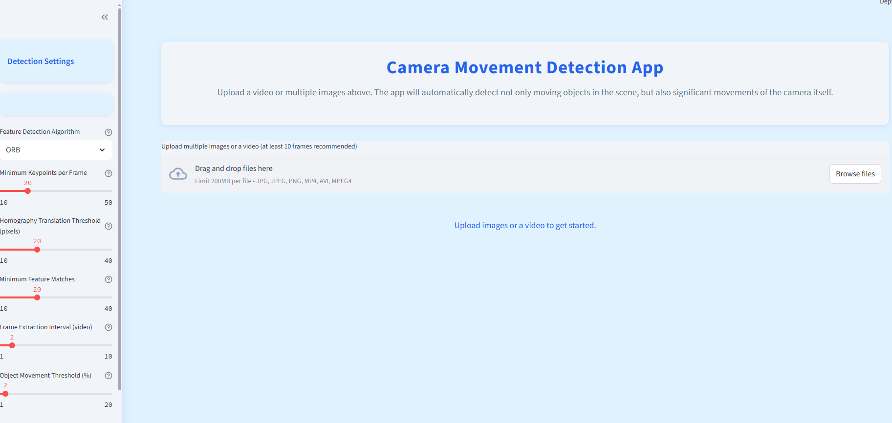
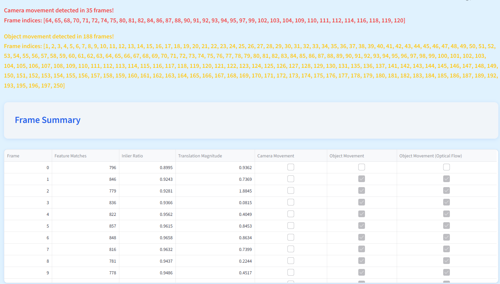
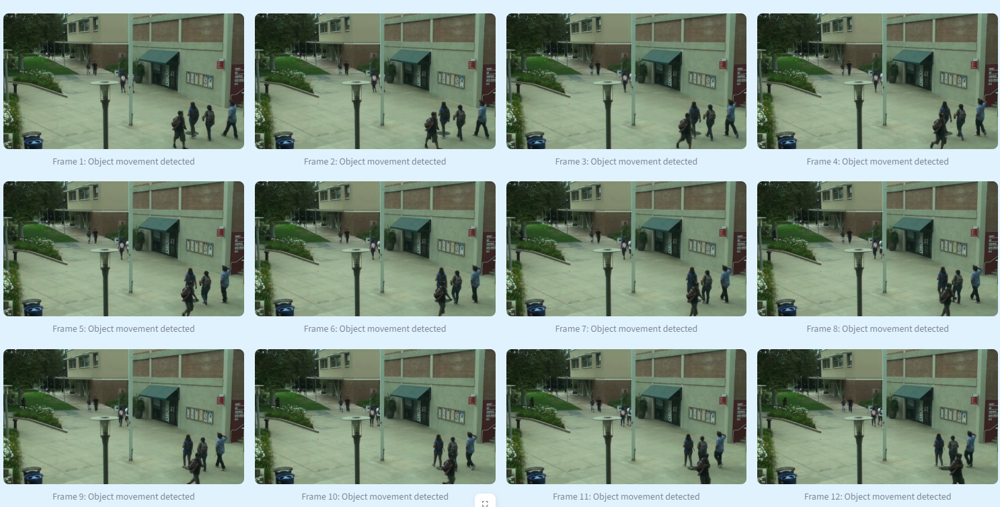

# Camera Movement Detection App

Kamera ve nesne hareketlerini tespit eden, kullanıcı dostu bir Streamlit uygulaması.

## İçindekiler
- [Proje Amacı ve Yaklaşım](#proje-amacı-ve-yaklaşım)
- [Kullanılan Veri Seti](#kullanılan-veri-seti)
- [Kurulum ve Çalıştırma](#kurulum-ve-çalıştırma)
- [Kullanım](#kullanım)
- [Parametre Açıklamaları](#parametre-açıklamaları)
- [Dosya ve Dizin Yapısı](#dosya-ve-dizin-yapısı)
- [Ekran Görüntüleri](#ekran-görüntüleri)
- [Canlı Uygulama Bağlantısı](#canlı-uygulama-bağlantısı)
- [Zorluklar ve Varsayımlar](#zorluklar-ve-varsayımlar)
- [Destek ve Katkı Bilgisi](#destek-ve-katkı-bilgisi)

## Proje Amacı ve Yaklaşım
Bu projede amaç, yüklenen video veya çoklu görsellerde hem sahnedeki nesne hareketlerini hem de kamera hareketlerini otomatik olarak tespit etmektir. Hareket tespiti için ardışık kareler arasında anahtar noktalar (feature points) tespit edilip eşleştirilir. Homografi matrisindeki belirgin değişiklikler kamera hareketine, sabit kamera altında ise optik akış ile tespit edilen geniş alanlı değişiklikler nesne hareketine işaret eder. Kullanıcı, analiz hassasiyetini ve algoritma türünü arayüzden ayarlayabilir.

- **Kullanılan Algoritmalar:**
  - ORB ve SIFT anahtar nokta tespiti
  - Homografi ile kamera hareketi analizi
  - Optik akış ile nesne hareketi tespiti

## Kullanılan Veri Seti
Bu uygulama, kullanıcıdan yüklenen video veya görseller üzerinde çalışır. Sabit bir açık veri seti kullanılmamaktadır. Test ve demo için herhangi bir video veya ardışık çekilmiş görseller kullanılabilir.

## Kurulum ve Çalıştırma
1. **Gereksinimler:**
   - Python 3.8+
   - Gereken paketler: `streamlit`, `opencv-python`, `opencv-contrib-python`, `numpy`, `pandas`, `Pillow`

2. **Kurulum:**
```bash
pip install -r requirements.txt
```

3. **Çalıştırma:**
```bash
streamlit run app.py
```

## Kullanım
1. Açılan web arayüzünde, sol panelden analiz parametrelerini ayarlayın.
2. "Upload" alanından bir video yükleyin.
3. Yükleme sonrası analiz otomatik başlar ve sonuçlar ekranda özet tablo ve galeri olarak gösterilir.
4. Sonuçlar arasında hangi karelerde kamera veya nesne hareketi tespit edildiği, özet tablo ve görsellerle birlikte sunulur.
5. Galeri bölümünde kamera veya nesne hareketi tespit edilen frame gösterilir ve kamera mı nesne mi hareketi olduğu

## Parametre Açıklamaları
- **Feature Detection Algorithm (Özellik Algoritması):**
  - ORB veya SIFT seçilebilir. SIFT daha hassas, ORB daha hızlıdır.
- **Minimum Keypoints per Frame (Kare Başına Minimum Anahtar Nokta):**
  - Her karede analiz için bulunması gereken minimum anahtar nokta sayısı. Düşük değerler, az detaylı görüntülerde çalışmayı sağlar. (Varsayılan: 20)
- **Homography Translation Threshold (pixels) (Homografi Çeviri Eşiği - piksel):**
  - Kareler arası kamera hareketinin "anlamlı" sayılması için gereken minimum piksel kayması. Düşük değerler küçük hareketleri, yüksek değerler sadece büyük hareketleri algılar. (Varsayılan: 20)
- **Minimum Feature Matches (Minimum Özellik Eşleşmesi):**
  - Kareler arası analiz için gereken minimum eşleşen anahtar nokta sayısı. Düşük değerler daha toleranslı, yüksek değerler daha seçici analiz yapar. (Varsayılan: 20)
- **Frame Extraction Interval (video) (Kare Atlatma Aralığı):**
  - Videolarda her N. kare analiz edilir. 1 = her kare, 2 = her 2. kare, vb. (Varsayılan: 2)
- **Object Movement Threshold (%) (Nesne Hareketi Eşiği - %):**
  - Kamera sabitken, hareketli piksel oranı bu değeri aşarsa nesne hareketi olarak algılanır. (Varsayılan: %2)

## Dosya ve Dizin Yapısı
``` 
atp-uygulama/
├── app.py                # Streamlit arayüzü ve ana uygulama dosyası
├── movement_detector.py  # (Varsa) Hareket tespitine dair yardımcı fonksiyonlar
├── movement_utils.py     # Hareket tespit algoritmalarının ana fonksiyonları
├── requirements.txt      # Gerekli Python paketleri
├── runtime.txt           # (Varsa) Ortam/versiyon bilgisi
├── style.css             # Uygulamanın özel stil dosyası
├── README.md             # Proje açıklamaları ve dokümantasyon
└── docs/
    └── screenshots/      # Ekran görüntülerinin saklandığı klasör
```

## Ekran Görüntüleri
### Girdi Yükleme Ekranı
Aşağıda, uygulamanın açılışında dosya yükleme ve parametre ayarlarının bulunduğu ekran örneği yer almaktadır:



### Sonuçlar ve Özet Tablo
Video yüklendikten ve analiz tamamlandıktan sonra, hareket tespit sonuçları ve özet tablo aşağıdaki gibi görüntülenir:



### Hareket Tespit Edilen Kareler Galerisi
Kamera veya nesne hareketi tespit edilen kareler galeri şeklinde gösterilir:



## Canlı Uygulama Bağlantısı Alttadır;

https://core-talent-omerbugraaskin-camera-movement.streamlit.app/

## Zorluklar ve Varsayımlar
- **Zorluklar:**
  - Düşük detaylı veya bulanık karelerde yeterli anahtar nokta bulunamaması.
  - Kamera hareketi ile nesne hareketinin ayrıştırılması.
  - Farklı çözünürlük ve formatlardaki dosyaların işlenmesi.
- **Varsayımlar:**
  - Yüklenen görseller veya videolar ardışık ve mantıklı bir sıralamaya sahip.
  - Video dosyalarında kareler arası çok büyük zaman atlamaları yok.

## Destek ve Katkı Bilgisi

"Zorluklar ve Varsayımlar" ile "Parametre Açıklamaları" bölümlerinin hazırlanmasında yapay zeka (ChatGPT) desteği alınmıştır. Bunun için kullandığım komutlar şunlardır:

- bu projedeki parametrelerin açıklamalarını anaşılır ve kısa özet şeklinde verir misin.
- bu projedeki zorluklar ve varsayımlar hakkında bana yardımcı olur musun.